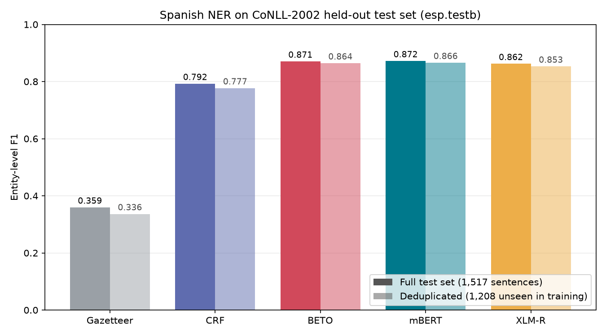
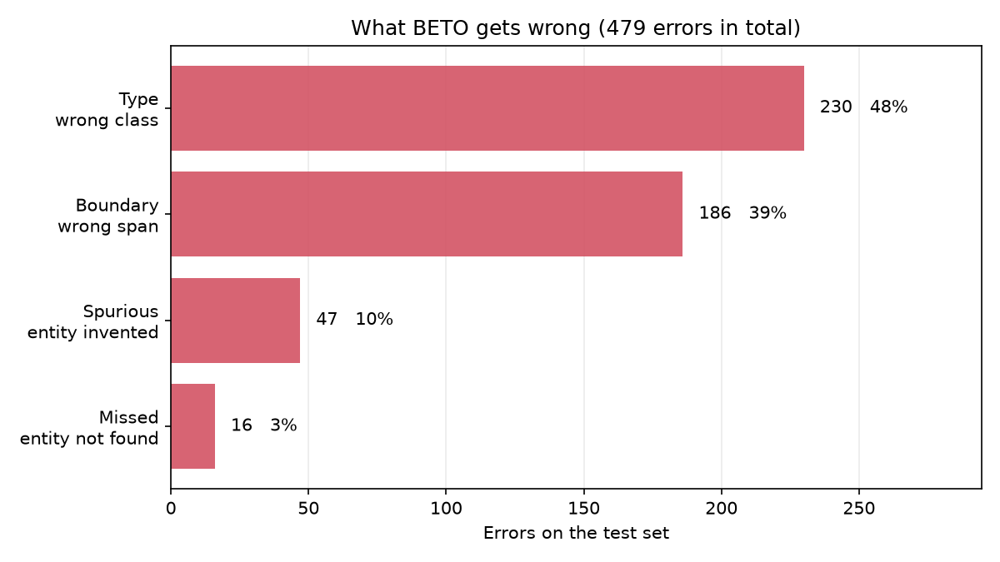
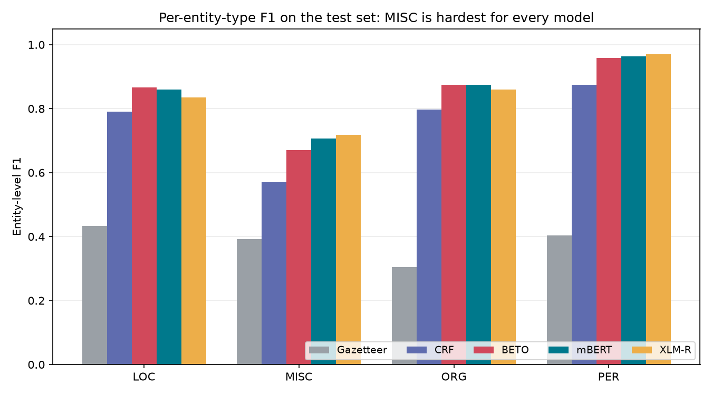

# Spanish Named Entity Recognition: from lookup tables to transformers

End-to-end NER for Spanish on the CoNLL-2002 benchmark. Five models, one
evaluation protocol, a single read of the held-out test set, and confidence
intervals on every comparison.

**Live demo:** _(deployment instructions in [Deploying the demo](#deploying-the-demo);
replace this line with the Space URL once published)_

---

## Results

Entity-level F1 on the official held-out test split (`esp.testb`), read exactly
once at the end of the project.

| Model | Params | Test F1 | Test F1 (dedup.) | Precision | Recall | Train time |
|---|---:|---:|---:|---:|---:|---:|
| Gazetteer (longest match) | — | 0.3595 | 0.3364 | 0.2634 | 0.5662 | 0.05 s |
| CRF (hand-engineered features) | — | 0.7924 | 0.7769 | 0.7966 | 0.7881 | 51 s |
| **BETO** (`bert-base-spanish-wwm-cased`) | 109 M | **0.8705** | 0.8642 | 0.8626 | 0.8786 | 105 s |
| **mBERT** (`bert-base-multilingual-cased`) | 177 M | **0.8720** | 0.8659 | 0.8634 | 0.8809 | 110 s |
| XLM-R (`xlm-roberta-base`) | 277 M | 0.8622 | 0.8530 | 0.8568 | 0.8677 | 452 s |

Timings are on a single RTX 5060 Ti (8 GB), four epochs each.



The *deduplicated* column is explained in
[A problem with the benchmark](#a-problem-with-the-benchmark).

All numbers are produced by `scripts/evaluate_test.py` and stored verbatim in
[`reports/metrics_test.json`](reports/metrics_test.json). Nothing in this README
is typed by hand.

---

## Three findings

### 1. The best model on the development set was the worst on the test set

| Model | Dev F1 | Test F1 | Rank change |
|---|---:|---:|:--|
| XLM-R | **0.8765** (1st) | 0.8622 (3rd) | ▼ 2 |
| mBERT | 0.8665 (2nd) | **0.8720** (1st) | ▲ 1 |
| BETO | 0.8640 (3rd) | 0.8705 (2nd) | ▲ 1 |

Selecting a model on development-set performance alone — the default in most
tutorials — would have shipped the worst of the three transformers. This is
model-selection overfitting on a 1,915-sentence dev set, observed directly
rather than described in the abstract.

XLM-R is also the most expensive model in the comparison by a wide margin: 277 M
parameters and 452 s of training against BETO's 109 M and 105 s, a 4.3x cost for
the lowest test score. Bigger and more multilingual was, here, strictly worse on
every axis that matters.

### 2. A Spanish-specific encoder gives no measurable advantage here

Paired bootstrap, 10,000 resamples, against the top-ranked model:

| Comparison | ΔF1 | 95% CI | p | Significant |
|---|---:|:--|---:|:--:|
| mBERT vs BETO | +0.0015 | [−0.0086, +0.0113] | 0.75 | **no** |
| mBERT vs XLM-R | +0.0098 | [+0.0003, +0.0195] | 0.04 | yes |
| mBERT vs CRF | +0.0797 | [+0.0624, +0.0978] | <0.001 | yes |
| mBERT vs Gazetteer | +0.5125 | [+0.4931, +0.5316] | <0.001 | yes |

BETO and mBERT are statistically indistinguishable. The project set out to test
the hypothesis that a Spanish-specific model beats a multilingual one on Spanish
NER, and **on this benchmark that hypothesis is not supported.**

Reporting `mBERT 0.8720 > BETO 0.8705` as a result would have been a claim about
sampling noise. A one-point F1 gap on 1,517 sentences usually is.

### 3. Detection is solved; classification is not



Of BETO's 479 test-set errors:

| Error type | Count | Share | What it means |
|---|---:|---:|---|
| Type | 230 | 48.0% | Correct span, wrong class |
| Boundary | 186 | 38.8% | Correct class, wrong span |
| Spurious | 47 | 9.8% | Entity predicted where there is none |
| **Missed** | **16** | **3.3%** | Gold entity not found at all |

The model almost always finds the entity — only 3.3% of errors are outright
misses. Nearly nine out of ten errors are about *labelling* something it already
located. Effort spent on recall would be largely wasted; the payoff is in
disambiguating types, especially ORG vs LOC, and in span boundaries.



`MISC` is the weakest class for every model (BETO F1 = 0.671 vs 0.958 for `PER`).
That is expected: `MISC` is defined negatively in the annotation guidelines — it
is everything that is an entity but not a person, organisation or location — so
it has no consistent surface form to learn.

---

## The task

Given Spanish text, tag every mention of a **person**, **organisation**,
**location** or **miscellaneous** entity (nationalities, events, works of art).

```
El   Banco Central de Chile   anuncio hoy en   Santiago
     └────── ORG ─────────┘                    └─ LOC ─┘
```

NER is the extraction layer under document search, compliance screening, KYC and
entity-based analytics. It is also the standard proving ground for sequence
labelling, which makes it a good benchmark for comparing model families under a
fixed protocol.

## The data

[CoNLL-2002](https://www.clips.uantwerpen.be/conll2002/ner/) Spanish, from EFE
newswire text (May 2000), annotated by the University of Antwerp.

| Split | File | Sentences | Tokens | Entities |
|---|---|---:|---:|---:|
| Train | `esp.train` | 8,323 | 264,715 | 18,798 |
| Development | `esp.testa` | 1,915 | 52,923 | 4,352 |
| Test | `esp.testb` | 1,517 | 51,533 | 3,559 |

Entities are IOB2-tagged across four types: LOC (4,914), ORG (7,390), PER
(4,321), MISC (2,173) in the training split.

The corpus is parsed from the raw column files by `src/spanish_ner/data.py`
rather than through a hosted loading script, and every file is SHA-256 verified
on load. This matters in practice: `datasets>=3` dropped support for script-based
datasets, which broke the conventional `load_dataset("conll2002", "es")` path
entirely.

> **A parsing detail that cost real F1.** These files are UTF-8, despite this
> corpus almost always being read as latin-1. Decoding them as latin-1 silently
> corrupts about 27,000 accented tokens — `información` becomes `información` —
> and nothing raises. Training runs, loss decreases, and the score is quietly
> worse. `tests/test_data.py::test_encoding_is_utf8_not_mojibake` is the tripwire.

### A problem with the benchmark

The official splits are **not disjoint**. 309 of the 1,517 test sentences
(20.4%) appear verbatim in the training data:

| | Count |
|---|---:|
| Test sentences duplicated in train | 309 (20.4%) |
| ...that are the single token `-` | 162 |
| ...that are agency datelines (`Madrid , 23 may ( EFE ) .`) | ~52 |
| ...with 10 or more tokens (real content) | 86 |
| **Test entities inside duplicated sentences** | **336 / 3,559 (9.4%)** |

Most of the overlap is newswire boilerplate, but 9.4% of test entities sit in
sentences the model has already seen. Removing them from the official benchmark
would break comparability with published results, so every table reports both:

- **Full** — the official 1,517 sentences, comparable with the literature.
- **Deduplicated** — the 1,208 sentences absent from training, a stricter
  estimate of generalisation to genuinely unseen text.

The ranking is unchanged, but the *cost* of deduplication is not uniform, and
the pattern is informative:

| Model | Full | Deduplicated | Drop |
|---|---:|---:|---:|
| Gazetteer | 0.3595 | 0.3364 | **−2.31 pts** |
| CRF | 0.7924 | 0.7769 | −1.55 pts |
| XLM-R | 0.8622 | 0.8530 | −0.92 pts |
| BETO | 0.8705 | 0.8642 | −0.63 pts |
| mBERT | 0.8720 | 0.8659 | −0.61 pts |

**The more a model relies on memorisation, the more it loses when memorised
sentences are removed.** The gazetteer — which is nothing but memorisation —
gives up almost four times as much as the transformers. This is a direct,
quantitative measurement of generalisation, obtained for free from a defect in
the benchmark.

These counts are pinned in `tests/test_data.py::TestSplitOverlap`, so if the raw
data ever changes the test suite fails rather than the metrics drifting.

---

## Approach

Four modelling families, in increasing order of capacity. Each exists to make
the next one's score interpretable.

**1. Gazetteer.** Memorise every entity surface form in the training set;
longest-match at inference; resolve type ambiguity by majority vote. This is the
floor, and it quantifies how much of the task is pure memorisation
(F1 = 0.36 — about 41% of BETO's score with no learning at all).

**2. CRF.** A linear-chain conditional random field over hand-designed features:
casing, prefixes and suffixes up to three characters, digit and hyphen patterns,
the PAROLE POS tag both full and truncated to two characters, and all of the
above for a ±2 token window. Suffix features carry more signal in Spanish than
in English because of its richer inflectional morphology. A CRF scores the whole
tag sequence jointly, so it learns structural constraints such as *I-PER never
follows B-ORG* directly from the transition weights. This was state of the art
before contextual embeddings, and it is the real bar a transformer has to clear.

**3–5. Transformers.** BETO, mBERT and XLM-R fine-tuned for token
classification, all through the same script so no result can differ because of
an accidental change in procedure.

### Sub-word label alignment

The central technical problem. The corpus is annotated per word; BERT tokenises
into sub-words:

```
words       ["Telefónica",  "invirtió"          ]
labels      ["B-ORG",       "O"                 ]
sub-tokens  ["Telef", "##ónica", "invir", "##tió"]
```

Labels must be re-projected onto sub-tokens. We label the **first** sub-token of
each word and assign `-100` to the rest; PyTorch's cross-entropy ignores `-100`,
so continuation sub-tokens contribute no loss and no gradient.

The alternative — repeating the label on every sub-token — over-weights long
words in the loss and makes decoding ambiguous when sub-tokens of the same word
disagree. It also requires converting `B-` to `I-` on continuations, or the
decoded sequence contains two adjacent `B-ORG` tags and splits one entity into
two. Both strategies are implemented; `--label-all-subtokens` runs the ablation.

Misaligned labels are the classic silent failure in NER fine-tuning: the model
trains, the loss falls, and the target was wrong the whole time. Ten tests in
`tests/test_modeling.py` pin the alignment contract, including one that asserts
the test word actually splits into sub-tokens — otherwise the other tests would
pass while proving nothing.

### Evaluation protocol

- **Entity-level scoring** via `seqeval`, matching the official CoNLL script. A
  prediction counts only if type *and* both boundaries are exact. Token-level
  accuracy is meaningless here: ~88% of tokens are outside any entity, so a
  model predicting `O` everywhere scores 0.88 accuracy while finding nothing.
- **The test split is loaded by exactly one script.** `scripts/evaluate_test.py`
  is the only file in the repository that reads `esp.testb`. Baseline selection,
  hyperparameters, early stopping and error analysis all run on dev.
- **Best epoch by dev F1 is kept**, not the last, so a model that peaks at epoch
  3 and overfits at epoch 4 is not reported at its worst.
- **Reported scores are recomputed through `predict_sentences`** — the same
  inference path the demo uses — rather than trusting the `Trainer`'s internal
  loop. If the two ever disagree, the deployed model is not the one measured.
- **Paired bootstrap** on 10,000 resamples for every comparison. Both models are
  scored on the same resampled sentences, controlling for the fact that some
  sentences are simply harder. The implementation resamples precomputed
  per-sentence TP/predicted/gold counts instead of re-running `seqeval`, which
  turns hours into milliseconds.
- **Fixed seed (42)** across `random`, `numpy` and `torch`.

---

## Reproducing these numbers

Every command below was run to produce the tables above. Total wall-clock time
on an RTX 5060 Ti (8 GB): **about 15 minutes** for all five models plus
evaluation.

```bash
git clone https://github.com/JoseElias23/spanish-ner-beto.git
cd spanish-ner-beto
```

```bash
python -m venv .venv && source .venv/bin/activate   # Windows: .venv\Scripts\activate
pip install -e ".[dev,app]"
```

```bash
python scripts/download_data.py
```

Downloads the three raw corpus files and verifies their SHA-256 checksums.

```bash
python -m pytest
```

44 tests: corpus integrity, encoding, split overlap, entity decoding and
sub-word label alignment. Run this before trusting any number below.

```bash
python scripts/train_baselines.py
```

Gazetteer and CRF, evaluated on dev. About one minute.

```bash
python scripts/train_transformer.py
python scripts/train_transformer.py --model bert-base-multilingual-cased --tag mbert
python scripts/train_transformer.py --model xlm-roberta-base --tag xlmr
```

BETO and mBERT take under two minutes each on a modern consumer GPU; XLM-R takes
about 7.5 minutes. CPU works but is considerably slower.

```bash
python scripts/evaluate_test.py \
    --models models/bert-base-spanish-wwm-cased/best models/mbert/best models/xlmr/best
```

The single read of the held-out test set. Writes `reports/metrics_test.json`.

```bash
python scripts/error_analysis.py
```

Regenerates every figure in this README plus `reports/error_analysis.json`.

```bash
python app/app.py
```

Serves the Gradio demo at `http://127.0.0.1:7860`.

---

## Deploying the demo

The demo runs on the Hugging Face Spaces free CPU tier.

1. Create a Space at [huggingface.co/new-space](https://huggingface.co/new-space),
   SDK **Gradio**, hardware **CPU basic (free)**.
2. Push the trained checkpoint to a model repository:

   ```bash
   huggingface-cli login
   huggingface-cli upload <your-username>/spanish-ner-beto \
       models/bert-base-spanish-wwm-cased/best
   ```

3. Copy `app/app.py` and `app/requirements.txt` into the Space repository,
   renaming nothing.
4. Set the Space secret `NER_MODEL_PATH` to `<your-username>/spanish-ner-beto`.
   The app reads that variable and falls back to the local checkpoint path when
   it is unset, so the same file runs locally and in production.
5. Push. The Space builds in a few minutes.

BETO is the deployed model rather than mBERT. The two are statistically
indistinguishable (ΔF1 = 0.0015, p = 0.75), and given a tie the Spanish-specific
model is the better default for Spanish input: a smaller, better-fitted
vocabulary means fewer sub-tokens per word and faster CPU inference.

---

## Repository layout

```
spanish-ner-beto/
├── configs/default.yaml        every hyperparameter that affects a metric
├── data/raw/                   corpus files (gitignored, checksum-verified)
├── src/spanish_ner/
│   ├── data.py                 CoNLL parser, label schema, overlap analysis
│   ├── baselines.py            gazetteer and CRF
│   ├── modeling.py             sub-word alignment, transformer inference
│   ├── evaluate.py             seqeval scoring, paired bootstrap
│   └── utils.py                seeding, config, JSON reporting
├── scripts/
│   ├── download_data.py        fetch and verify the corpus
│   ├── train_baselines.py      gazetteer + CRF, dev evaluation
│   ├── train_transformer.py    fine-tune any HF checkpoint
│   ├── evaluate_test.py        the only script that reads the test split
│   └── error_analysis.py       figures and error categorisation
├── tests/                      44 tests
├── reports/                    metrics as JSON, figures as PNG
└── app/                        Gradio demo for Hugging Face Spaces
```

---

## Limitations and next steps

Stated plainly, because every one of these is a question worth being asked.

**Domain.** The corpus is Spanish newswire from May 2000, from a single agency
(EFE), and heavily European in vocabulary and place names. Performance on
Chilean text, social media, clinical notes or legal documents will be
substantially lower and is **not measured here**. Any number in this README is a
claim about EFE newswire and nothing else.

**MISC is weak.** F1 = 0.671, against 0.958 for PER. The class is defined
negatively in the annotation guidelines, so it has no consistent surface form.
Improving it likely needs a different formulation, not more training data.

**Single seed.** Each configuration was trained once with seed 42. The bootstrap
quantifies uncertainty from the *test sample*, not from training-run variance.
Seed variance for BERT fine-tuning on a corpus this size is typically a few
tenths of an F1 point — comparable to the BETO/mBERT gap, which reinforces
finding 2 rather than undermining it. Training each model across five seeds and
reporting mean ± standard deviation is the correct next step and is not done
here.

**No hyperparameter search.** Learning rate, batch size and epoch count are
standard values from the BERT fine-tuning literature, applied identically to all
three transformers. Fair for comparison, almost certainly not optimal for any of
them.

**Truncation.** `max_length=256` sub-tokens. No training sentence is affected,
so this costs nothing on this corpus, but the demo silently tags words beyond
that limit as `O`. Long documents should be chunked before being passed in.

**The dev/test rank inversion deserves more work.** Finding 1 is a single
observation. Whether XLM-R is genuinely worse here or was unlucky needs repeated
runs to settle.

### Planned

- Multi-seed training with variance reporting
- Evaluation on Chilean Spanish to measure the domain gap directly
- A CRF decoding layer on top of the transformer, which should reduce the 38.8%
  boundary-error share
- Confidence calibration, so the demo can flag uncertain predictions

---

## Citation

```bibtex
@inproceedings{tjongkimsang2002conll,
  title     = {Introduction to the CoNLL-2002 Shared Task: Language-Independent
               Named Entity Recognition},
  author    = {Tjong Kim Sang, Erik F.},
  booktitle = {Proceedings of CoNLL-2002},
  year      = {2002}
}

@inproceedings{canete2020spanish,
  title     = {Spanish Pre-Trained BERT Model and Evaluation Data},
  author    = {Ca{\~n}ete, Jos{\'e} and Chaperon, Gabriel and Fuentes, Rodrigo and
               Ho, Jou-Hui and Kang, Hojin and P{\'e}rez, Jorge},
  booktitle = {PML4DC at ICLR 2020},
  year      = {2020}
}
```

## License

MIT — see [LICENSE](LICENSE). The CoNLL-2002 corpus is distributed by the
University of Antwerp under its own terms.
